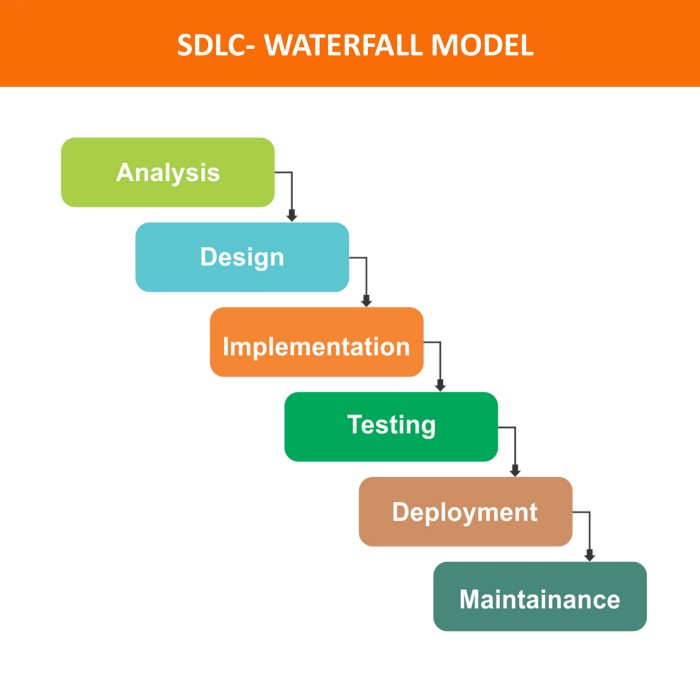
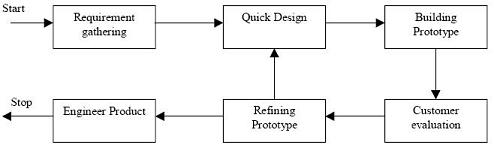

# SDLC Kategori Klasik :

2 Diantaranya yaitu : 

## 1. Waterfall

Model ini mengembangkan perangkat lunak secara berurutan, dimulai dari atas hingga ke bawah (seperti air terjun). Proses pelaksanaan model ini tidak bisa loncat-loncat sehingga akan memakan waktu yang cukup lama, namun dalam pemeliharaan/ maintenance software akan lebih mudah, karena model ini bersifat lengkap.

## 2. Prototype

Model ini dimulai dengan membuat prototype berdasarkan kebutuhan user/client yang sifatnya belum pasti, sehingga memungkinkan user/client dapat mencoba prototype dan mengevaluasi sistem yang dibuat oleh developer sebelum di implementasikan. Hal ini membantu user/client dalam menentukan persyaratan / kebutuhan sistem yang spesifik.

# SDLC Kategori Agile :

SDLC Model Agile merupakan model yang ditujukan untuk membantu pengembang software dalam membangun project yang dapat beradaptasi pada perubahan dengan cepat, yaitu dengan cara melakukan update yang berkelanjutan.